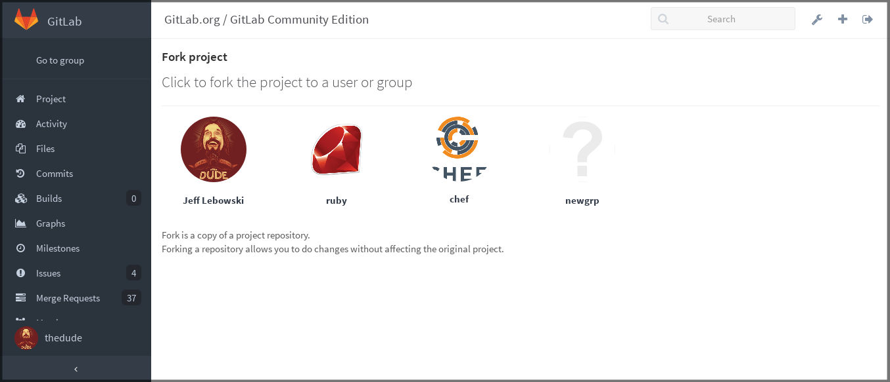
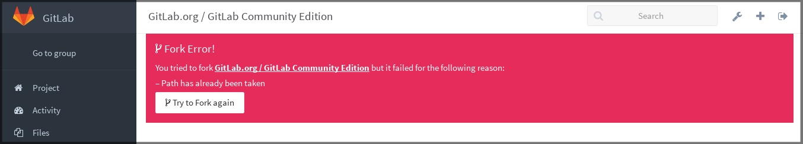
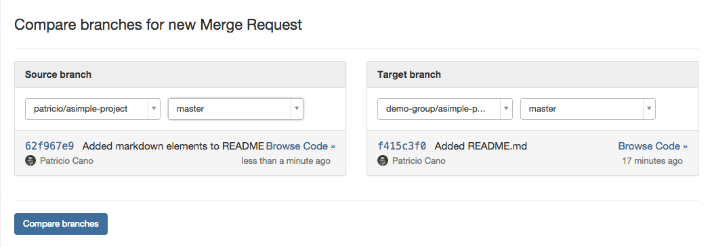
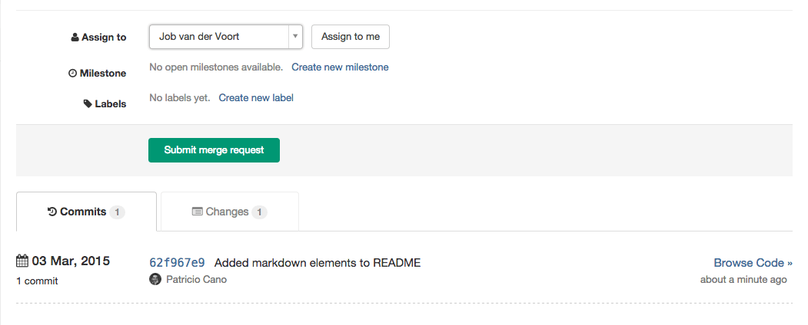

# Project borking workflow

Borking a project to your own namespace is useful if you have no write
access to the project you want to contribute to. If you do have write
access or can request it, we recommend working together in the same
repository since it is simpler. See our [DoggoHub Flow](doggohub_flow.md)
document more information about using branches to work together.

## Creating a bork

Borking a project is in most cases a two-step process.

1.  Click on the bork button located in the middle of the page or a project's
    home page right next to the stars button.

    

    ---

1.  Once you do that, you'll be presented with a screen where you can choose
    the namespace to bork to. Only namespaces (groups and your own
    namespace) where you have write access to, will be shown. Click on the
    namespace to create your bork there.

    

    ---

    **Note:**
    If the namespace you chose to bork the project to has another project with
    the same path name, you will be presented with a warning that the borking
    could not be completed. Try to resolve the error and repeat the borking
    process.

    

    ---

After the borking is done, you can start working on the newly created
repository. There, you will have full [Owner](../user/permissions.md)
access, so you can set it up as you please.

## Merging upstream

Once you are ready to send your code back to the main project, you need
to create a merge request. Choose your borked project's main branch as
the source and the original project's main branch as the destination and
create the [merge request](merge_requests.md).

You can then assign the merge request to someone to have them review
your changes. Upon pressing the 'Accept Merge Request' button, your
changes will be added to the repository and branch you're merging into.

[doggohub flow]: https://about.doggohub.com/2014/09/29/doggohub-flow/ "DoggoHub Flow blog post"
